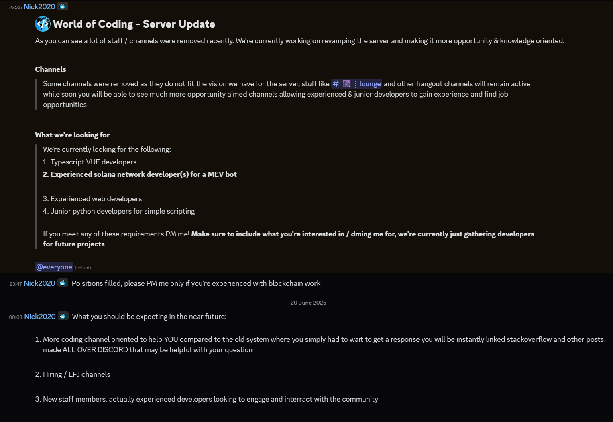

# Hack

(19/06/25)

The server got hacked. The hackers put up a scam on the notice board, banned all
the real mods, and then also proceeded to ban a bunch of random people for little or
no reason, all under [nick](../users/f-n/nick.md)'s (now compromised) account.

At the time, the [duck cult](duck-cult.md) server and a temporary replacement server
named "World of Coders" created by moogly are being used.

(20/06/2025)

Server vanity is hijacked and put up for sale.

(21/06/2025)

Moogly's server starts being used as a replacement woc, and is called "WoC emergency
server".

Later in the day, it's renamed to 2FA haters, in reference to nick's mistake.
