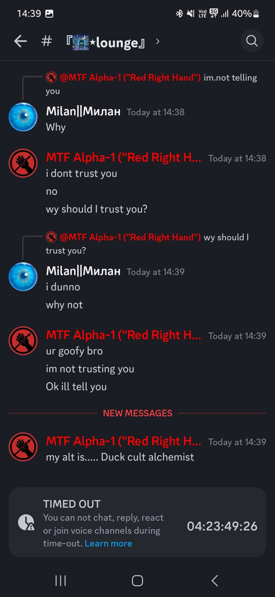
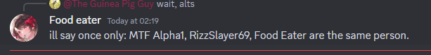

# MTF Alpha-1 (“Red Right Hand”)

Ah, the infamous SCP Foundation personnel. A warrior against brainrot, a shadow
in the server’s history, and perhaps its greatest enigma. Alpha was once among
the most active members, even achieving a legendary milestone—over 15,000 messages
in a single month, a record untouched by mere mortals.

But with great activity comes great… exile. Alpha was no stranger to controversy,
amassing an army of alt accounts—some say more than 10, though the true number may
never be known. Over half of them met their untimely demise at the hands of the
banhammer, yet whispers persist

Alpha is still here. Watching. Waiting. Lurking in the depths of the server,
prepared to strike at the first sign of degeneracy. When the server teeters on
the brink of chaos, when brainrot spreads unchecked, fear not—for MTF Alpha-1
still stands guard. He is known by many names, including but not limited to:
Hopeless Child, Angel of Death, Main Battle Tank, Putin’s son in law and many
more.

## Known alts

- Duck cult alchemist (admitted)
- Food eater (admitted)
- Rizzslayer69 (admitted)

MTF glazing himself, he didn't even try to hide it. Cracks under pressure too
easily to be able to hide his alts *at all* - *Mnem*

This guy is such a dumbass and bro was glazing himself, doesn't even know scps properly and yet calls himself and
truly a dumbass - *Kanata*

      
    
